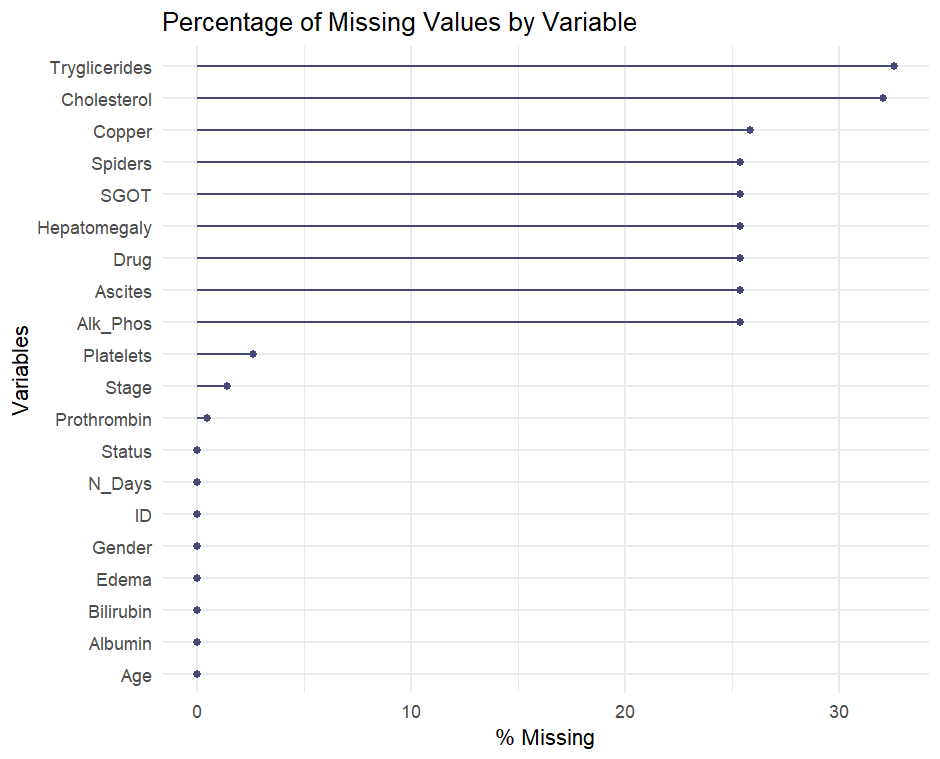
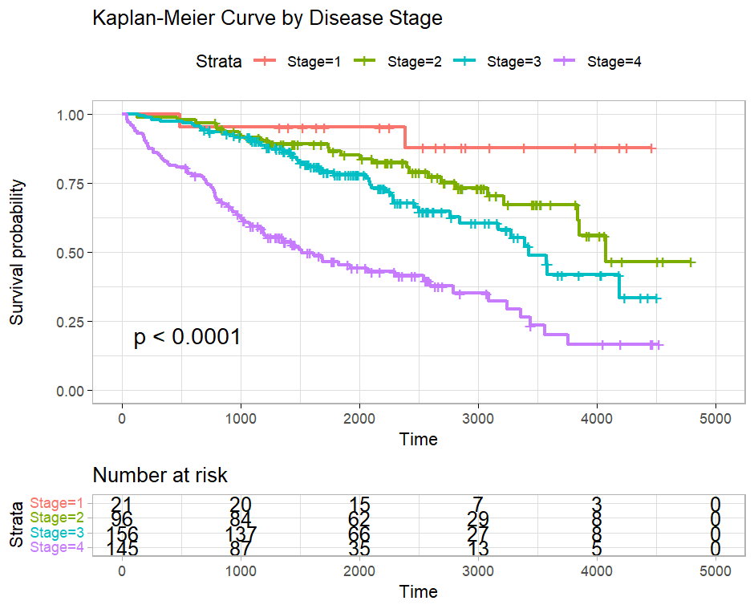

# Survival Analysis of Cirrhosis Patients Using R

## Project Overview
This project performs an in-depth **survival analysis on cirrhosis patients** using the **Cirrhosis dataset from Kaggle**.  
The aim is to identify **key clinical predictors of survival**, evaluate the **effect of treatment (D-penicillamine vs. placebo)**, and understand how disease stage and liver function affect outcomes.

---

## Objective
To determine which patient characteristics and clinical measures most strongly influence survival among individuals diagnosed with cirrhosis.

---

## Dataset Description

**Source:** [Cirrhosis Dataset – Kaggle](https://www.kaggle.com/datasets/fedesoriano/cirrhosis-prediction-dataset)  
**Observations:** 418 patients  
**Events:** 161 deaths  

| Variable | Description |
|-----------|-------------|
| N_Days | Follow-up time in days |
| Status | Outcome: D (Death), C (Censored), CL (Transplant) |
| Drug | Treatment group (D-penicillamine / Placebo) |
| Age | Patient’s age |
| Bilirubin | Blood bilirubin level (mg/dL) |
| Albumin | Serum albumin (g/dL) |
| Prothrombin | Prothrombin time |
| Stage | Disease stage (1–4) |
| Others | Liver markers and physical indicators (Ascites, Spiders, Hepatomegaly, etc.) |

---

## Methodology

1. **Data Cleaning & Preprocessing**
   - Handled missing values and factor encoding.
   - Recoded `Status` (D=1, C/CL=0).
   - Visualized missing data percentage.

2. **Kaplan-Meier Survival Analysis**
   - Compared survival curves by **Drug** and **Disease Stage**.
   - Computed **median survival times** and **log-rank tests**.

3. **Cox Proportional Hazards Model**
   - Identified significant predictors: Age, Bilirubin, Albumin, Prothrombin, and Drug.
   - Checked proportional hazards assumptions (Schoenfeld test).

4. **Visualization**
   - Plotted survival curves, Schoenfeld residuals, and hazard ratios (forest plot).

---

## Visualizations

### 1️. Percentage of Missing Values
Shows the completeness of each variable before imputation or cleaning.

---

### 2️. Kaplan-Meier Survival Curve by Drug Type
Compares **D-penicillamine** and **Placebo** groups.

**Median Survival:**  
- D-penicillamine: 3222 days  
- Placebo: 3428 days  

*No significant difference in survival between treatments.*

---

### 3️. Kaplan-Meier Survival Curve by Disease Stage
Displays survival probability across **Stage 1–4** cirrhosis.

**Median Survival:**  
- Stage 1: NA (few events)  
- Stage 2: 4079 days  
- Stage 3: 3428 days  
- Stage 4: 1518 days  

*Survival declines sharply with increasing disease severity.*

---

### 4. Schoenfeld Residuals (Global Test)
Tests proportional hazard assumptions for covariates.

| Variable | p-value | Interpretation |
|-----------|----------|----------------|
| Age | 0.953 | PH holds |
| Drug | 0.812 | PH holds |
| Albumin | 0.202 | PH holds |
| Bilirubin | 0.0126 | Violation |
| Prothrombin | 0.0041 | Violation |
| **Global** | **0.00097** | PH assumption partially violated |

*Bilirubin and Prothrombin effects vary over time.*

---

### 5. Hazard Ratios from Cox Proportional Hazards Model
Visual summary of variables influencing survival.

| Predictor | Hazard Ratio | p-value | Interpretation |
|------------|---------------|----------|----------------|
| Age | 1.0001 | 8.72e-05 | Minor age effect |
| Bilirubin | 1.142 | <2e-16 | Strong risk factor |
| Albumin | 0.433 | 4.04e-05 | Protective |
| Prothrombin | 1.245 | 0.0006 | Higher hazard |
| Drug (Placebo) | 1.008 | 0.961 | No effect |

*Liver function markers (Bilirubin, Albumin, Prothrombin) are key determinants of survival.*

---

## Key Insights

1. **Treatment (Drug):** No significant survival improvement from D-penicillamine.  
2. **Liver Function:**  
   - High bilirubin → higher mortality.  
   - High albumin → better prognosis.  
   - High prothrombin time → worse survival.  
3. **Disease Stage:** Strong negative gradient; Stage 4 patients have the shortest survival.  
4. **Model Fit:** Concordance = 0.768 → good predictive performance.  
5. **Proportional Hazard Violation:** Suggests potential non-linear time effects for Bilirubin and Prothrombin.

---

## Limitations

- Competing risk of transplant (CL) treated as censored → may overestimate survival.  
- PH violations indicate some covariates change effect over time.  
- Missing forest plot issue due to version mismatch in `survminer`.  

---

## Clinical Implications

- Early detection and liver function stabilization (albumin improvement, bilirubin reduction) are crucial.  
- No evidence supports the superiority of D-penicillamine in prolonging life expectancy.  
- Results align with established medical understanding of cirrhosis progression.

---

## Technologies Used
- **Language:** R  
- **Packages:** `survival`, `survminer`, `dplyr`, `ggplot2`, `cmprsk`  
- **IDE:** RStudio  

---

## References
- [Cirrhosis Dataset – Kaggle](https://www.kaggle.com/datasets/fedesoriano/cirrhosis-prediction-dataset)  
- Therneau, T. M., & Grambsch, P. M. (2000). *Modeling Survival Data: Extending the Cox Model*. Springer.  
- Kassambara, A., Kosinski, M., & Biecek, P. *survminer: Drawing Survival Curves using ggplot2.*

---

## Author
**Srashti Tiwari**  
Statistics Student | Aspiring Data Analyst | Passionate about Health Data Analytics  
*tiwarisrashti23@gmail.com*  